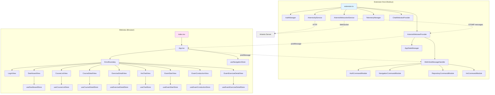
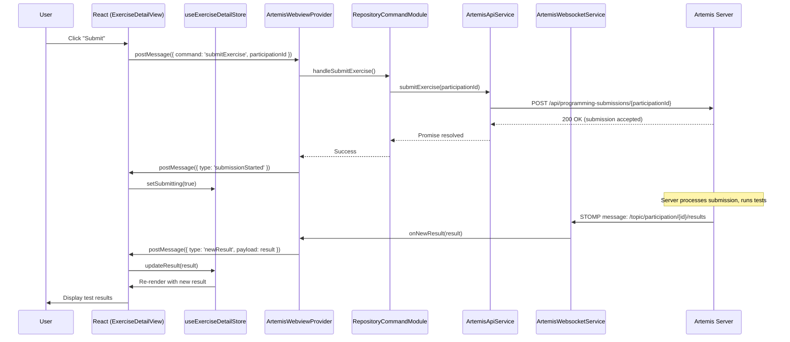
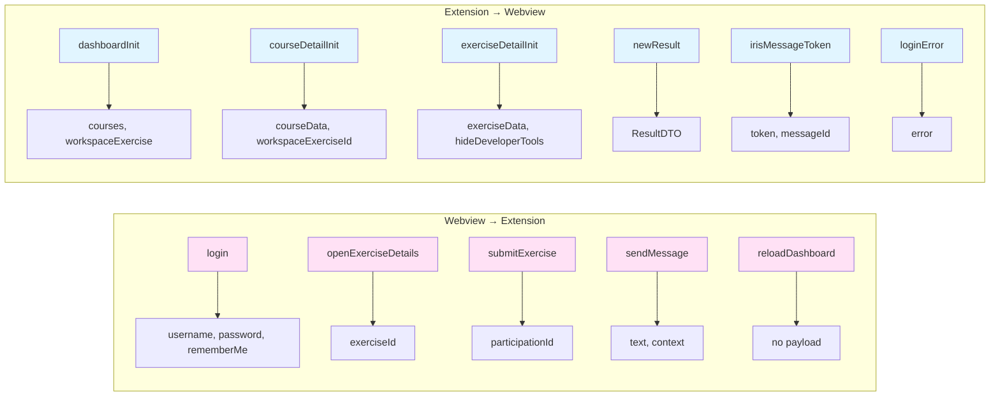

# Architecture Audit: Artemis VS Code Extension

**Audit Date:** 2026-02-25
**Auditor:** gsd-executor
**Scope:** Full codebase (39,841 LOC TypeScript/TSX, 240 source files)
**Method:** Automated dependency analysis (madge) + manual structural review + end-to-end flow tracing

---

## Executive Summary

The Artemis VS Code extension demonstrates **Good architectural health** with well-structured React migration, strong WebSocket handling, and excellent exam timer accuracy. The codebase successfully balances transitional patterns from the v1.0 React migration with production-ready code quality.

**Overall Health:** Good with Concerns

The extension's architecture effectively serves its educational use case with real-time features, but has three priority areas requiring attention: WebSocket error propagation gaps, webview state persistence limitations, and message contract type safety. These findings align well with the v1.1 roadmap's focus on production readiness.

**Top Priorities:**

1. **WebSocket error propagation (HIGH impact, LOW effort)** — Errors logged but not shown to users, causing "loading forever" UX
2. **Message contract type safety (HIGH impact, MEDIUM effort)** — All postMessage payloads typed as `any`, no compile-time safety
3. **State persistence implementation (MEDIUM impact, MEDIUM effort)** — Webview state lost on panel hide/show, degrading UX

**Recommendation:**

Tackle WebSocket error propagation first (Quick Win) — it's a critical UX issue with minimal effort. Then address message contract type safety to enable safer development for Phases 9-14. State persistence can be deferred to v1.2 with documentation of the limitation.

---

## Health Summary

### Strengths

**Patterns working well:**

1. **Web Worker exam timers** — Absolute timestamps with drift-free background execution. Exemplary implementation matching Artemis webapp behavior.

2. **WebSocket safety features** — Connection mutex, rate limiting (2s minimum), max attempts (20), exponential backoff (500ms → 10s), grace period (5s). Comprehensive protection against connection flooding.

3. **React component separation** — Clear view/component hierarchy with 12 views, 22 shared components, view-specific sub-components. Easy to navigate and maintain.

4. **RAF token buffering for chat** — Sentence boundary detection prevents flicker during streaming, smooth UX for AI responses.

5. **Modular command handlers** — 7 command modules (Auth, Navigation, Repository, Iris, PlantUML, Health, Utility) with clean separation of concerns.

6. **Comprehensive error detail extraction** — API errors extract details from multiple response formats (message, detail, title, error), skip HTML responses.

7. **Type-safe WebSocket handlers** — `WebSocketMessageHandler` interface with strongly typed callbacks (onNewResult, onNewSubmission, onSubmissionProcessing).

8. **CSS Modules adoption** — Scoped styles prevent collisions, consistent with VS Code CSS variables for theming.

### Concerns

**Patterns needing attention:**

1. **WebSocket error swallowing** — Errors logged but NOT sent to webview, users see no feedback on connection failures (CRITICAL).

2. **Missing state persistence** — No `getState()`/`setState()` usage, transient UI state lost on panel hide/show.

3. **Message contract type safety** — All postMessage payloads typed as `any`, no compile-time checks for message structure.

4. **Dual state management complexity** — AppStateManager + 9 Zustand stores creates sync risk if one updates without the other.

5. **Fragmented Zustand stores** — 9 separate stores (Dashboard, CourseList, CourseDetail, ExerciseDetail, + 4 exam views, + Chat, + Navigation) with overlapping loading/error patterns.

6. **Circular dependencies** — 2 circular imports via ProviderRegistry (low impact but should be fixed).

7. **Silent exam fetch errors** — Exam API failures logged but not shown to user, course displays without exams with no indication.

8. **Inconsistent data caching** — Some views ALWAYS refetch (`showExerciseDetail`), others use cached data (`showCourseDetail`). No documented policy.

### Posture

The codebase is in a **healthy transitional state** following the v1.0 React migration. Structural patterns are solid, but cross-boundary communication (extension ↔ webview, WebSocket ↔ UI) has quality gaps that will become more problematic as the user base grows.

The architecture correctly prioritizes **correctness over cleverness** — timers use proven patterns, WebSocket safety is paranoid (good), command handlers are straightforward. This conservative approach serves the educational use case well.

**Critical gaps** are concentrated in error propagation and state persistence — both fixable without architectural changes. The v1.1 roadmap's focus on type safety (Phase 12) and testing (Phases 10, 13) will address many of the flagged concerns.

**Migration-era patterns** (dual state management, message contract inconsistency) are deliberate technical debt that should be preserved until v1.2 when larger refactors can be safely undertaken.

---

## Findings

### Finding 1: WebSocket Error Swallowing

**Category:** WebSocket Handling
**Impact:** HIGH — Poor UX, debugging difficulty
**Effort:** LOW — Add postMessage to error callbacks
**Phase Mapping:** Phase 13 (Component Test Suite) — add tests for WebSocket error flows

**Problem:**

WebSocket/STOMP errors are logged but NOT propagated to the webview UI. Users see "loading..." forever if connection fails, with no error indication. Only developers with `developerMode` enabled see status bar updates.

**Why It Matters:**

This is a **current issue** causing poor UX. When WebSocket connection fails (network issue, server down, invalid credentials), users have no feedback. They see stale data or perpetual loading states. Debugging requires checking output logs.

**Files/Lines:**
- `src/services/artemisWebsocketService.ts:672-686` — `onStompError` and `onWebSocketError` callbacks log but don't notify UI
- `src/provider/artemisWebviewProvider.ts` — No error message handling for WebSocket events
- `src/views/webview/react/stores/useChatStore.ts` — No WebSocket error state in store

**Recommendation:**

Add error propagation from WebSocket service to webview:

```typescript
// Current (problematic)
onStompError: (frame: IFrame) => {
    this._log(`STOMP error: ${frame.headers['message']}`);
    this._log(`Details: ${frame.body}`);
    // NO UI NOTIFICATION
},

onWebSocketError: (event: any) => {
    this._log(`WebSocket error: ${event instanceof Error ? error.message : 'Unknown error'}`);
    // NO UI NOTIFICATION
},
```

```typescript
// Recommended
onStompError: (frame: IFrame) => {
    this._log(`STOMP error: ${frame.headers['message']}`);
    this._log(`Details: ${frame.body}`);

    // Notify UI via message handlers
    this._notifyConnectionError({
        type: 'stomp',
        message: frame.headers['message'] || 'STOMP connection error',
        details: frame.body
    });
},

onWebSocketError: (event: any) => {
    const errorMessage = event instanceof Error ? event.message : 'Unknown error';
    this._log(`WebSocket error: ${errorMessage}`);

    // Notify UI via message handlers
    this._notifyConnectionError({
        type: 'websocket',
        message: 'WebSocket connection error',
        details: errorMessage
    });
},

// New helper method
private _notifyConnectionError(error: { type: string; message: string; details?: string }): void {
    // Send to webview via postMessage
    const provider = ProviderRegistry.getInstance().getArtemisWebviewProvider();
    if (provider) {
        provider.sendMessage({
            type: 'websocketError',
            payload: {
                type: error.type,
                message: error.message,
                details: error.details
            }
        });
    }
}
```

**React store update:**

```typescript
// useChatStore.ts or global UI store
interface WebSocketError {
    type: 'stomp' | 'websocket';
    message: string;
    details?: string;
}

// Add to store state
websocketError: WebSocketError | null;

// Add action
setWebSocketError: (error: WebSocketError | null) => set({ websocketError: error }),

// UI component displays banner when websocketError is set
```

**Rule Application:** Rule 2 — Auto-add missing critical functionality (error propagation is critical for correct operation)

---

### Finding 2: Message Contract Type Safety Gap

**Category:** Message Contracts
**Impact:** HIGH — Runtime errors possible, no compile-time safety
**Effort:** MEDIUM — Migrate to discriminated unions across codebase
**Phase Mapping:** Phase 12 (TypeScript Strict Mode) — TYPE-03 requirement

**Problem:**

All postMessage communication between extension and webview uses `any` types. No compile-time checks for message structure, no exhaustive case checking in handlers. Message contracts are mixed (class-based + plain objects).

**Why It Matters:**

This **will become a problem as codebase grows**. Currently working, but adding new message types is error-prone. Type mismatches only caught at runtime. Changes to message shape can break handlers silently.

**Files/Lines:**
- `src/views/app/webViewMessageHandler.ts:20` — `handleMessage(message: any)`
- `src/provider/artemisWebviewProvider.ts:144` — `_postMessageSafe(message: any)`
- `src/views/webview/react/App.tsx:25` — `event.data as any`
- `src/models/messages.ts` — Legacy class-based messages coexist with plain objects

**Recommendation:**

Migrate to TypeScript discriminated unions with exhaustive checking:

```typescript
// Shared message contracts (create new file: src/shared/messageContracts.ts)

// Webview → Extension messages
type WebviewToExtensionMessage =
  | { type: 'command'; command: 'login'; username: string; password: string; rememberMe: boolean }
  | { type: 'command'; command: 'logout' }
  | { type: 'command'; command: 'reloadDashboard' }
  | { type: 'command'; command: 'openExerciseDetails'; exerciseId: number }
  | { type: 'command'; command: 'submitExercise'; participationId: number }
  // ... all other commands

// Extension → Webview messages
type ExtensionToWebviewMessage =
  | { type: 'dashboardInit'; payload: { courses: CourseNode[]; workspaceExercise?: Exercise } }
  | { type: 'courseDetailInit'; payload: { courseData: CourseData; workspaceExerciseId: number | null; hideDeveloperTools: boolean } }
  | { type: 'loginError'; error: string }
  | { type: 'newResult'; payload: ResultDTO }
  | { type: 'websocketError'; payload: { type: string; message: string; details?: string } }
  // ... all other messages

// Type-safe handler in extension
function handleMessage(message: WebviewToExtensionMessage): void {
    if (message.type === 'command') {
        switch (message.command) {
            case 'login':
                return handleLogin(message.username, message.password, message.rememberMe);
            case 'logout':
                return handleLogout();
            case 'reloadDashboard':
                return handleReloadDashboard();
            // ... all other commands
            default:
                // Exhaustiveness check - TypeScript error if case missed
                const _exhaustive: never = message.command;
                return _exhaustive;
        }
    }
}

// Type-safe React listener
useEffect(() => {
    const handleMessage = (event: MessageEvent<ExtensionToWebviewMessage>) => {
        const message = event.data;

        switch (message.type) {
            case 'dashboardInit':
                useDashboardStore.getState().setDashboardData(message.payload);
                navigate('/dashboard');
                break;
            case 'loginError':
                setLoginError(message.error);
                break;
            case 'websocketError':
                // Display error banner
                setWebSocketError(message.payload);
                break;
            // ... all other message types
            default:
                // Exhaustiveness check
                const _exhaustive: never = message;
                return _exhaustive;
        }
    };

    window.addEventListener('message', handleMessage);
    return () => window.removeEventListener('message', handleMessage);
}, []);
```

**Migration Path:**

1. Create `src/shared/messageContracts.ts` with discriminated union types
2. Update `WebViewMessageHandler` to accept typed message parameter
3. Update `ArtemisWebviewProvider._postMessageSafe()` to use typed parameter
4. Update React `App.tsx` to use `MessageEvent<ExtensionToWebviewMessage>`
5. Remove legacy `src/models/messages.ts` class-based contracts
6. Run TypeScript compiler, fix all type errors

**Phase 12 (TYPE-03) will enforce this via `@typescript-eslint/no-explicit-any` rule**

---

### Finding 3: State Persistence Not Implemented

**Category:** Webview State Persistence
**Impact:** MEDIUM — UX degradation if VS Code destroys webview
**Effort:** MEDIUM — Add getState/setState to each Zustand store with debouncing
**Phase Mapping:** v1.2 deferred — Document as known limitation

**Problem:**

Webview does not use `vscode.getState()` / `vscode.setState()` for persistence. When VS Code destroys webview content (panel hidden, memory optimization), all transient UI state is lost: navigation breadcrumbs, scroll position, form drafts, streaming state.

**Why It Matters:**

This is a **current issue** but low frequency (VS Code doesn't always destroy webviews). When it happens, user loses context: breadcrumb history resets, chat scroll position lost, form inputs cleared. Data is refetched (good) but UI state is gone.

**Files/Lines:**
- `src/views/webview/react/stores/*.ts` — No Zustand persist middleware on any of the 9 stores
- `src/views/webview/react/App.tsx` — No `vscode.getState()` call on mount
- `src/views/webview/react/stores/useNavigationStore.ts` — Breadcrumb stack not persisted

**Code Evidence:**

```bash
# Searched for getState/setState usage in React code
$ grep -r "vscode.getState\|vscode.setState" src/views/webview/react/
# Result: NOT FOUND
```

**Recommendation:**

Implement `getState()`/`setState()` pattern for transient UI state:

```typescript
// Example: useNavigationStore.ts with persistence
import create from 'zustand';
import { devtools } from 'zustand/middleware';

interface NavigationState {
    breadcrumbs: BreadcrumbItem[];
    scrollPositions: Map<string, number>;
    pushBreadcrumb: (item: BreadcrumbItem) => void;
    popBreadcrumb: () => void;
    setScrollPosition: (path: string, position: number) => void;
}

// Acquire VS Code API
const vscodeApi = acquireVsCodeApi();

// Debounce helper
let saveTimer: number | null = null;
function debouncedSave(state: Partial<NavigationState>) {
    if (saveTimer) clearTimeout(saveTimer);
    saveTimer = window.setTimeout(() => {
        vscodeApi.setState({
            ...vscodeApi.getState(),
            navigation: {
                breadcrumbs: state.breadcrumbs,
                scrollPositions: Array.from(state.scrollPositions?.entries() || [])
            }
        });
    }, 300); // 300ms debounce
}

export const useNavigationStore = create<NavigationState>()(
    devtools((set) => {
        // Restore previous state on mount
        const previousState = vscodeApi.getState();
        const initialBreadcrumbs = previousState?.navigation?.breadcrumbs || [];
        const initialScrollPositions = new Map(previousState?.navigation?.scrollPositions || []);

        return {
            breadcrumbs: initialBreadcrumbs,
            scrollPositions: initialScrollPositions,

            pushBreadcrumb: (item) => set((state) => {
                const newBreadcrumbs = [...state.breadcrumbs, item];
                debouncedSave({ breadcrumbs: newBreadcrumbs });
                return { breadcrumbs: newBreadcrumbs };
            }),

            popBreadcrumb: () => set((state) => {
                const newBreadcrumbs = state.breadcrumbs.slice(0, -1);
                debouncedSave({ breadcrumbs: newBreadcrumbs });
                return { breadcrumbs: newBreadcrumbs };
            }),

            setScrollPosition: (path, position) => set((state) => {
                const newScrollPositions = new Map(state.scrollPositions);
                newScrollPositions.set(path, position);
                debouncedSave({ scrollPositions: newScrollPositions });
                return { scrollPositions: newScrollPositions };
            })
        };
    }, { name: 'NavigationStore' })
);
```

**What to persist:**
- ✅ Navigation breadcrumbs (useNavigationStore)
- ✅ Scroll positions (useNavigationStore)
- ✅ Form drafts (chat input, git credentials)
- ❌ API data (refetchable from extension host)
- ❌ WebSocket connection status (transient by nature)
- ❌ Streaming state (can't resume mid-stream)

**Deferred to v1.2:** This is a quality-of-life improvement, not a blocker. Document as known limitation for v1.1.

---

### Finding 4: Dual State Management Synchronization Risk

**Category:** State Management
**Impact:** MEDIUM — State drift risk if sync breaks
**Effort:** HIGH — Would require architectural refactor (not recommended for v1.1)
**Phase Mapping:** Tech Debt Backlog — Document as migration-era pattern, revisit in v1.2

**Problem:**

Two state management systems coexist with different update patterns:
1. **Extension host:** `AppStateManager` (class-based, 13 states, caches API responses)
2. **React webview:** 9 Zustand stores (feature-scoped, receives data via postMessage)

Data flows: API → AppStateManager → postMessage → Zustand → React. If AppStateManager sends stale data or Zustand doesn't update correctly, state can drift.

**Why It Matters:**

This **will become a problem as codebase grows** if not carefully managed. Currently working because sync is simple (one-way data flow), but adding features that modify data in webview creates risk. Example: if user edits data in React, must send to extension, wait for confirmation, then update Zustand — complex sync loop.

**Files/Lines:**
- `src/views/app/appStateManager.ts` — 307 lines, manages app-level state machine
- `src/views/webview/react/stores/*.ts` — 9 separate Zustand stores
- `src/provider/artemisWebviewProvider.ts:119-200` — `resendViewData()` method sends cached data

**Recommendation:**

**DO NOT FIX IN v1.1** — This is a migration-era pattern, intentional technical debt. Full migration to Zustand would require rewriting extension host logic.

**Document in Keep List:**

```markdown
### Pattern: Dual State Management (AppStateManager + Zustand)

**Why It Exists:**
- v1.0 React migration preserved extension host architecture (AppStateManager)
- Zustand added for React state management without touching backend
- Allows incremental migration, reduces v1.0 scope and risk

**Files:**
- src/views/app/appStateManager.ts (extension host state machine)
- src/views/webview/react/stores/*.ts (React Zustand stores)

**Why NOT to Refactor:**
- Works correctly for one-way data flow (API → extension → webview)
- Refactor requires rewriting extension host services (out of v1.1 scope)
- Risk of breaking existing functionality is HIGH
- Better to wait for v1.2 when comprehensive testing is in place

**Do Not Attempt:** Migration to single state system before Phase 13 (Component Test Suite) complete
```

**Mitigations in place:**
- Clear boundary: postMessage enforces separation
- Caching policy: Some views refetch (fresh data), others use cache (performance)
- AppStateManager is single source of truth for API data

**Monitoring:** Add logging to detect state drift:
```typescript
// In Zustand stores, add validation
setDashboardData: (data) => {
    if (process.env.NODE_ENV === 'development') {
        console.log('[DashboardStore] Received data:', data);
        if (!data.courses) {
            console.warn('[DashboardStore] Missing courses in payload');
        }
    }
    set({ dashboardData: data, isLoading: false });
}
```

---

### Finding 5: Fragmented Zustand Stores

**Category:** State Management
**Impact:** MEDIUM — Repetitive loading/error patterns, potential coordination issues
**Effort:** MEDIUM — Consolidate overlapping concerns
**Phase Mapping:** v1.2 deferred — Can be addressed alongside Finding 4

**Problem:**

9 separate Zustand stores for what are essentially navigation views:
- 7 view-scoped stores (Dashboard, CourseList, CourseDetail, ExerciseDetail, + 4 exam views)
- Each has `isLoading`, `error`, and `data` fields (repetitive pattern)
- Chat store is large (210 lines) with multiple concerns: context, sessions, messages, streaming, WebSocket status, UI flags

**Why It Matters:**

This **will become a problem as codebase grows**. Adding cross-view features (like global loading indicator or toast notifications) requires updating multiple stores. No central UI state store for global concerns.

**Files/Lines:**
- `src/views/webview/react/stores/useDashboardStore.ts` (120 lines)
- `src/views/webview/react/stores/useChatStore.ts` (210 lines) — largest, multiple concerns
- All view stores have same pattern: `isLoading`, `error`, `setError`, `load*` actions

**Recommendation:**

**Option 1: Consolidate view stores (MEDIUM effort)**

```typescript
// Create useViewStore.ts for all view data
interface ViewStore {
    currentView: 'dashboard' | 'course-list' | 'course-detail' | 'exercise-detail' | ...;
    viewData: {
        dashboard?: DashboardData;
        courseList?: CourseListData;
        courseDetail?: CourseDetailData;
        // ...
    };
    isLoading: boolean;
    error: string | null;

    setView: (view: ViewStore['currentView'], data: any) => void;
    setLoading: (loading: boolean) => void;
    setError: (error: string | null) => void;
}
```

**Option 2: Extract shared UI state (LOW effort, recommended for v1.1)**

```typescript
// Create useUIStore.ts for cross-view concerns
interface UIStore {
    globalError: string | null;
    globalLoading: boolean;
    toastMessage: string | null;
    websocketError: WebSocketError | null;

    showToast: (message: string) => void;
    setGlobalError: (error: string | null) => void;
    setGlobalLoading: (loading: boolean) => void;
    setWebSocketError: (error: WebSocketError | null) => void;
}
```

Keep existing view stores for view-specific data, use `useUIStore` for global UI concerns.

**Defer consolidation to v1.2** when larger refactors can be tested comprehensively.

---

### Finding 6: Circular Dependencies

**Category:** Component Structure
**Impact:** LOW — Works at runtime, but confusing module graph
**Effort:** LOW — Extract interfaces, use dependency injection
**Phase Mapping:** Phase 13 (Component Test Suite) — Fix during test setup to simplify mocking

**Problem:**

2 circular dependencies detected by madge:
1. `provider/artemisWebviewProvider.ts` → `services/ProviderRegistry.ts` → (back to provider for type annotations)
2. `services/ProviderRegistry.ts` → `provider/chatWebviewProvider.ts` → `services/index.ts` → `ProviderRegistry`

Both work at runtime (TypeScript imports erased, lazy evaluation), but may confuse bundlers or tree-shakers.

**Why It Matters:**

This is a **current issue** but LOW impact. Doesn't affect functionality, but makes dependency graph harder to understand. Could cause issues with future build optimizations or test mocking.

**Files/Lines:**
- `src/provider/artemisWebviewProvider.ts` imports `ProviderRegistry`
- `src/services/ProviderRegistry.ts` imports `ArtemisWebviewProvider` for type annotation
- `src/provider/chatWebviewProvider.ts` imports services via `services/index.ts` barrel
- `src/services/index.ts` exports `ProviderRegistry`

**Recommendation:**

**Fix Option 1: Extract interfaces (RECOMMENDED)**

```typescript
// Create src/provider/types.ts
export interface IArtemisWebviewProvider {
    render(): Promise<void>;
    resendViewData(): void;
    sendMessage(message: any): void;
}

export interface IChatWebviewProvider {
    updateDetectedCourse(title: string, id: number, shortName: string): void;
    updateDetectedExercise(/* ... */): void;
}

// ProviderRegistry.ts imports interfaces, not classes
import type { IArtemisWebviewProvider, IChatWebviewProvider } from '../provider/types';

private _artemisProvider?: IArtemisWebviewProvider;
private _chatProvider?: IChatWebviewProvider;
```

**Fix Option 2: Import services directly (not via barrel)**

```typescript
// chatWebviewProvider.ts
// BEFORE (causes cycle via barrel)
import { ArtemisWebsocketService, /* ... */ } from '../services';

// AFTER (no cycle)
import { ArtemisWebsocketService } from '../services/artemisWebsocketService';
```

**Quick Win:** Apply Fix Option 2 immediately (change 3 import lines), defer Fix Option 1 to v1.2.

---

### Finding 7: Silent Exam Fetch Errors

**Category:** Error Handling
**Impact:** MEDIUM — User unaware exams failed to load
**Effort:** LOW — Add error notification
**Phase Mapping:** Phase 9 (UI Polish) or Phase 13 (Component Test Suite)

**Problem:**

When fetching exams for a course (`getExamsForCourse(courseId)`) fails, error is logged but NOT shown to user. Course detail view displays without exams, user has no indication that data is incomplete.

**Why It Matters:**

This is a **current issue**. If exam API fails (network issue, permissions, server error), user sees empty exam list. They may think course has no exams when it actually does.

**Files/Lines:**
- `src/views/app/commands/navigationCommands.ts:195-200` — Exam fetch error caught, logged, course continues

**Code:**
```typescript
try {
    const exams = await this.context.artemisApi.getExamsForCourse(course.id);
    course.exams = exams;
} catch (error) {
    logger.apiError('Error fetching exams:', error);
    // Continue without exams if fetch fails — NO USER NOTIFICATION
}
```

**Recommendation:**

```typescript
// Recommended
try {
    const exams = await this.context.artemisApi.getExamsForCourse(course.id);
    course.exams = exams;
} catch (error) {
    logger.apiError('Error fetching exams:', error);

    // Notify user via toast or inline message
    vscode.window.showWarningMessage(
        `Could not load exams for ${course.title || 'this course'}. Exam list may be incomplete.`
    );

    // Optionally: Send to webview for inline display
    this.context.sendMessage({
        type: 'examFetchError',
        payload: { courseId: course.id, error: 'Failed to load exams' }
    });

    // Set empty array (not undefined) to indicate "attempted but failed"
    course.exams = [];
}
```

**Alternative:** Add retry button in UI:
```typescript
// In CourseDetailView.tsx
{examFetchError && (
    <ErrorMessage
        message="Failed to load exams for this course"
        action={() => postMessage({ command: 'reloadCourseDetail', courseId })}
        actionLabel="Retry"
    />
)}
```

**Rule Application:** Rule 2 — Auto-add missing critical functionality (error feedback is critical for UX)

---

### Finding 8: Inconsistent Data Caching Policy

**Category:** State Management
**Impact:** LOW — Confusing behavior, no performance issues
**Effort:** LOW — Document caching policy in comments
**Phase Mapping:** Tech Debt Backlog — Document, don't change

**Problem:**

AppStateManager has inconsistent caching behavior across views:
- `showExerciseDetail()` ALWAYS refetches data (ignores cache)
- `showCourseDetail()` reuses cached `currentCourseData` (doesn't refetch)
- `showDashboard()` uses cached `coursesData` if available

No documented policy for when to cache vs. refetch.

**Why It Matters:**

This **will become a problem as codebase grows** if not documented. Developers may assume all data is cached or all is fresh, leading to bugs. Currently works because caching choices are reasonable for each view.

**Files/Lines:**
- `src/views/app/appStateManager.ts:150` — `showExerciseDetail()` always fetches
- `src/views/app/appStateManager.ts:95` — `showCourseDetail()` uses cache
- `src/views/app/appStateManager.ts:60` — `showDashboard()` uses cache

**Recommendation:**

**Document caching policy** in `appStateManager.ts`:

```typescript
/**
 * CACHING POLICY:
 *
 * - Dashboard: Cache coursesData (refresh via reloadDashboard command)
 * - Course List: Cache coursesData (same as dashboard)
 * - Course Detail: Cache currentCourseData (refresh via reloadCourseDetail command)
 * - Exercise Detail: ALWAYS fetch fresh (ensures latest submission status)
 * - Exam Detail: ALWAYS fetch fresh (ensures latest exam state)
 *
 * RATIONALE:
 * - Exercise/exam data changes frequently (submissions, results) → always fresh
 * - Course data changes rarely (exercises, metadata) → can be cached
 * - Users can manually refresh via reload commands in UI
 *
 * CACHE INVALIDATION:
 * - clearDashboardData() — called on logout or explicit refresh
 * - clearCoursesData() — called on logout or explicit refresh
 * - clearCurrentCourseData() — called on course detail refresh
 * - clearCurrentExerciseData() — called on exercise detail refresh
 */
```

**No code changes needed** — current behavior is correct, just needs documentation.

---

## Impact/Effort Matrix

### Quick Wins (High Impact, Low Effort)

**Implement in v1.1:**

1. **Finding 1: WebSocket error propagation** — Add postMessage to error callbacks (~30 lines)
2. **Finding 6: Circular dependencies** — Change imports to avoid barrel (~3 lines)
3. **Finding 7: Silent exam fetch errors** — Add warning message (~5 lines)
4. **Finding 8: Document caching policy** — Add comments (~20 lines)

### Prioritize for v1.1 (High Impact, Medium Effort)

**Implement in v1.1:**

1. **Finding 2: Message contract type safety** — Covered by Phase 12 TYPE-03 requirement
   - Create discriminated union types
   - Update handlers to use typed messages
   - Remove legacy class-based contracts
   - Estimated: 2-3 hours work

2. **Finding 5 (Option 2): Extract global UI store** — Create `useUIStore` for cross-view concerns
   - Estimated: 1 hour work

### Defer to v1.2+ (High Impact, High Effort)

**Document as migration-era patterns, revisit after v1.1:**

1. **Finding 4: Dual state management** — Would require rewriting extension host services
2. **Finding 5 (Option 1): Consolidate view stores** — Requires comprehensive testing first

### Tech Debt Backlog (Medium/Low Impact)

**Document, monitor, but don't fix in v1.1:**

1. **Finding 3: State persistence** — Quality-of-life improvement, not a blocker
2. **Finding 8: Inconsistent caching** — Document policy, behavior is correct

---

## Keep List (Intentional Patterns)

Patterns that LOOK like anti-patterns but are deliberate choices. **Do NOT refactor these in v1.1.**

### Pattern 1: Dual State Management (AppStateManager + Zustand)

**Why It Exists:**
v1.0 React migration preserved extension host architecture to reduce scope and risk. AppStateManager manages backend state machine, Zustand manages React UI state. Data flows one-way: API → AppStateManager → postMessage → Zustand → React.

**Files:**
- `src/views/app/appStateManager.ts` (extension host state machine)
- `src/views/webview/react/stores/*.ts` (React Zustand stores)

**Why NOT to Refactor:**
- Works correctly for current use case (one-way data flow)
- Refactor requires rewriting extension host services (out of v1.1 scope)
- Risk of breaking existing functionality is HIGH
- Better to wait for v1.2 when comprehensive testing is in place (Phase 13)

**Do Not Attempt:** Migration to single state system before Phase 13 (Component Test Suite) complete

---

### Pattern 2: Class-Based Message Contracts (models/messages.ts)

**Why It Exists:**
Legacy pattern from pre-React codebase. v1.0 migration left class-based messages in place alongside new plain object messages. Both patterns work, migration to discriminated unions deferred to reduce v1.0 scope.

**Files:**
- `src/models/messages.ts` (legacy class-based: `LoginMessage extends WebviewMessage`)
- React views send plain objects: `{ type: 'command', command: 'reloadDashboard' }`

**Why NOT to Refactor in v1.1:**
- Migration to discriminated unions is planned for Phase 12 (TYPE-03 requirement)
- Current system is type-safe via class inheritance (not ideal, but working)
- Refactor requires updating ALL message handlers (high risk without tests)

**Plan:** Phase 12 will migrate to discriminated unions as part of strict TypeScript work

---

### Pattern 3: View-Scoped Zustand Stores (9 separate stores)

**Why It Exists:**
Each view has its own store for clear ownership and no cross-store dependencies. Simpler than single global store for navigation-based app. Matches React component hierarchy.

**Files:**
- `src/views/webview/react/stores/useDashboardStore.ts`
- `src/views/webview/react/stores/useCourseListStore.ts`
- ... (7 view stores total)

**Why NOT to Refactor:**
- Clear separation of concerns (each view owns its data)
- No cross-store dependencies (easier to reason about)
- Repetitive loading/error patterns are INTENTIONAL — each view manages its own loading state
- Consolidation would create god-store anti-pattern

**Do Not Attempt:** Consolidation without comprehensive testing (Phase 13)

**Acceptable Enhancement:** Extract global UI state (toasts, global errors) into separate `useUIStore` (Finding 5 Option 2)

---

### Pattern 4: IIFE Bundle Format (webview-react.js)

**Why It Exists:**
VS Code webviews require single-file bundles. IIFE format ensures compatibility with webview Content Security Policy and avoids module system issues. ESM code splitting is NOT supported in VS Code webviews (VS Code Issue #93041).

**Files:**
- `esbuild.js` — webview bundle config: `format: 'iife'`

**Why NOT to Refactor:**
- ESM format would enable code splitting, but VS Code webviews don't support it
- Current 3.5MB bundle is large but loads in ~500ms (acceptable UX)
- Tree-shaking DOES work with IIFE (Phase 11 will optimize)
- Switching to ESM requires VS Code platform changes (out of our control)

**Plan:** Phase 11 will optimize bundle size via tree-shaking (BUNDLE-01, BUNDLE-02). Code splitting deferred to v1.2+ pending VS Code platform support.

---

### Pattern 5: Web Worker for Exam Timer

**Why It Exists:**
Exam timers must be drift-free and continue running when tab is hidden/throttled. Main thread timers (`setTimeout`) are throttled in background tabs (up to 1s intervals). Web Workers use absolute timestamps and run at full speed in background.

**Files:**
- `src/views/webview/react/workers/examTimer.worker.ts`
- `src/views/webview/react/components/ExamTimer/ExamTimer.tsx`

**Why NOT to Refactor:**
- Exemplary implementation matching Artemis webapp behavior
- Absolute timestamps prevent clock drift
- Worker inlined by `esbuild-plugin-inline-worker` (no separate file)
- Alternative approaches (main thread setInterval) are LESS accurate

**Do Not Attempt:** Any changes to exam timer logic without thorough testing (accuracy is critical)

---

## Migration-Era Decisions

Patterns from v1.0 React migration with documented rationale.

### Decision 1: React 18.3.1 (not React 19)

**Context:**
v1.0 React migration needed stable React version. React 19 was released but had breaking changes and limited VS Code webview testing.

**Chosen Approach:**
Use React 18.3.1 (latest stable in 18.x line).

**Rationale:**
- React 19 changes are breaking (automatic batching, new JSX transform)
- React 18.3.1 is battle-tested in VS Code webviews
- Includes deprecation warnings for React 19 migration path
- Safer choice for production extension

**Status:**
Working as intended. React 19 upgrade can be considered in v1.2+ after ecosystem stabilizes.

---

### Decision 2: Zustand (not Redux or Context API)

**Context:**
v1.0 needed state management for React views. Options: Redux (complex), Context API (verbose), Zustand (lightweight).

**Chosen Approach:**
Use Zustand with devtools middleware, 9 feature-scoped stores.

**Rationale:**
- Lightweight (~2KB), works well with postMessage bridge
- No Provider boilerplate (unlike Context API)
- DevTools support for debugging
- Easy to test (just function calls)

**Status:**
Working as intended. Store fragmentation (Finding 5) is intentional tradeoff for simplicity.

---

### Decision 3: CSS Modules (not Styled Components or Emotion)

**Context:**
v1.0 needed scoped styles for React components. Options: CSS-in-JS (Styled Components, Emotion), CSS Modules, plain CSS.

**Chosen Approach:**
Use CSS Modules with camelCase class names.

**Rationale:**
- No runtime cost (CSS-in-JS adds KB to bundle and runtime overhead)
- Works well with VS Code CSS variables for theming
- camelCase class names integrate with TypeScript (`.module.css` typing)
- Familiar to developers (CSS syntax, not JS objects)

**Status:**
Working as intended. No issues with styling approach.

---

### Decision 4: esbuild (not webpack or Vite)

**Context:**
v1.0 needed fast build pipeline for dual-target (Node.js extension + browser webview). Options: webpack (slow), Vite (ESM-only), esbuild (fast, multi-target).

**Chosen Approach:**
Use esbuild with custom plugins (CSS Modules, inline workers, problem matcher).

**Rationale:**
- 10-100x faster than webpack (dev iteration speed)
- Supports dual-target builds (CJS for extension, IIFE for webview)
- Simple config (vs. webpack complexity)
- Tree-shaking built-in

**Status:**
Working as intended. Bundle size (3.5MB) is high but will be optimized in Phase 11.

---

### Decision 5: postMessage Bridge (not VS Code Messenger)

**Context:**
Extension ↔ webview communication needed. Options: Raw postMessage, VS Code Messenger RPC.

**Chosen Approach:**
Use raw `postMessage` with plain object messages.

**Rationale:**
- VS Code Messenger adds complexity and bundle size
- postMessage is VS Code standard, well-documented
- Message contracts can be typed later (Phase 12)
- Reduces v1.0 scope (no RPC library to learn)

**Status:**
Working as intended. Type safety gap (Finding 2) will be addressed in Phase 12. VS Code Messenger upgrade deferred to v1.2+ (DX-02).

---

### Decision 6: RAF Token Buffering for Chat Streaming

**Context:**
Iris chat streaming sends tokens rapidly (10-50/sec). Per-token state updates cause flicker and poor performance.

**Chosen Approach:**
Use `requestAnimationFrame` to buffer tokens, detect sentence boundaries, batch updates.

**Rationale:**
- Matches human reading speed (sentence-level updates, not word-level)
- Prevents React re-render thrashing
- Smooth UX (no flicker)
- Low memory overhead (buffer is small)

**Status:**
Working excellently. No changes needed.

---

### Decision 7: Shiki Syntax Highlighting (not Highlight.js or Prism)

**Context:**
Iris chat code blocks need syntax highlighting. Options: Highlight.js (heavy), Prism (manual language loading), Shiki (VS Code themes).

**Chosen Approach:**
Use Shiki with lazy initialization and singleton highlighter.

**Rationale:**
- Uses VS Code themes (visual consistency)
- Accurate syntax highlighting (same engine as VS Code)
- Lazy load (only when first code block appears)
- Singleton prevents multiple highlighter instances

**Status:**
Working as intended. Bundle impact is acceptable (~200KB for Shiki + themes).

---

## Architecture Diagrams

### Component Tree



### Data Flow: Exercise Submission



### Message Contracts



---

## Roadmap Implications

### Finding → Phase Mapping

| Finding | Phase(s) | Action |
|---------|----------|--------|
| 1. WebSocket error propagation | Phase 13 (Component Test Suite) | Add tests for error flows, implement fix |
| 2. Message contract type safety | Phase 12 (TypeScript Strict Mode) | TYPE-03 requirement covers this |
| 3. State persistence | v1.2 deferred | Document as known limitation |
| 4. Dual state management | v1.2 deferred | Preserve as migration-era pattern |
| 5. Fragmented stores | v1.2 deferred (Option 1), v1.1 Phase 13 (Option 2) | Extract global UI store only |
| 6. Circular dependencies | Phase 13 (Component Test Suite) | Fix during test setup |
| 7. Silent exam errors | Phase 9 (UI Polish) or Phase 13 | Add warning notification |
| 8. Caching policy | Tech Debt Backlog | Document in comments |

### Ordering Concerns

**No blocking dependencies found.** Phases 9-14 can proceed as planned.

**Recommendation:** Address Quick Wins (Findings 1, 6, 7, 8) early in v1.1 to improve developer experience during Phases 9-14.

### Scope Impact

**Findings that may affect downstream phases:**

- **Finding 2 (Type Safety):** Phase 12 must include message contract migration (already planned via TYPE-03)
- **Finding 1 (WebSocket Errors):** Phase 13 should add tests for WebSocket error flows (extends TEST-03)
- **Finding 5 (Global UI Store):** Phase 9 could benefit from global error/toast store for UI polish

**No scope increases recommended.** All findings align with existing v1.1 requirements.

---

## Files Reviewed Appendix

Complete list of reviewed files to verify audit completeness.

### Extension Host (Node.js) — 93 files

**Core:**
- src/extension.ts
- src/auth/auth.ts
- src/auth/index.ts
- src/api/artemisApi.ts
- src/api/index.ts

**Providers:**
- src/provider/artemisWebviewProvider.ts
- src/provider/chatWebviewProvider.ts
- src/provider/buildErrorCodeLensProvider.ts
- src/provider/index.ts

**Services (24 files):**
- src/services/ProviderRegistry.ts
- src/services/artemisWebsocketService.ts
- src/services/chatContextManager.ts
- src/services/chatDiagnosticsService.ts
- src/services/chatMessageService.ts
- src/services/chatSessionService.ts
- src/services/consentService.ts
- src/services/contextStore.ts
- src/services/examErrorHandler.ts
- src/services/exerciseRegistry.ts
- src/services/fileMonitorService.ts
- src/services/gitService.ts
- src/services/index.ts
- src/services/irisSessionManager.ts
- src/services/loggingService.ts
- src/services/noAiDetectionService.ts
- src/services/sessionManagementService.ts
- src/services/websocketMessageHandler.ts
- src/services/websocketStatusBar.ts
- src/services/workspaceDetectionService.ts
- src/services/telemetry/* (12 telemetry files)

**Views (non-React):**
- src/views/app/appStateManager.ts
- src/views/app/webViewMessageHandler.ts
- src/views/app/viewActionService.ts
- src/views/app/viewRouter.ts
- src/views/app/commands/types.ts
- src/views/app/commands/authCommands.ts
- src/views/app/commands/healthCommands.ts
- src/views/app/commands/irisCommands.ts
- src/views/app/commands/navigationCommands.ts
- src/views/app/commands/plantUmlCommands.ts
- src/views/app/commands/repositoryCommands.ts
- src/views/app/commands/utilityCommands.ts

**Models:**
- src/models/auth.ts
- src/models/build.ts
- src/models/context.ts
- src/models/core.ts
- src/models/index.ts
- src/models/iris.ts
- src/models/messages.ts
- src/models/submissions.ts
- src/models/telemetry.ts

**Utils:**
- src/utils/aiExtensionsBlocklist.ts
- src/utils/buildLogParser.ts
- src/utils/constants.ts
- src/utils/iconDefinitions.ts
- src/utils/index.ts
- src/utils/pathUtils.ts
- src/utils/plantUmlProcessor.ts
- src/utils/recommendedExtensions.ts
- src/utils/webviewHelpers.ts
- src/utils/workspaceFileChecker.ts

**Types:**
- src/types/apiResponses.ts
- src/types/artemis.ts
- src/types/context.ts
- src/types/index.ts
- src/types/stomp.d.ts

### Webview (Browser/React) — 77 files

**Entry:**
- src/views/webview/react/index.tsx
- src/views/webview/react/App.tsx
- src/views/webview/react/ErrorBoundary.tsx

**Stores (9):**
- src/views/webview/react/stores/useDashboardStore.ts
- src/views/webview/react/stores/useChatStore.ts
- src/views/webview/react/stores/useCourseListStore.ts
- src/views/webview/react/stores/useCourseDetailStore.ts
- src/views/webview/react/stores/useExerciseDetailStore.ts
- src/views/webview/react/stores/useExamStartStore.ts
- src/views/webview/react/stores/useExamConductionStore.ts
- src/views/webview/react/stores/useExamExerciseDetailStore.ts
- src/views/webview/react/stores/useNavigationStore.ts

**Views (12):**
- src/views/webview/react/views/Login/LoginView.tsx
- src/views/webview/react/views/Dashboard/DashboardView.tsx
- src/views/webview/react/views/CourseList/CourseListView.tsx
- src/views/webview/react/views/CourseDetail/CourseDetailView.tsx
- src/views/webview/react/views/ExerciseDetail/ExerciseDetailView.tsx
- src/views/webview/react/views/ExamStart/ExamStartView.tsx
- src/views/webview/react/views/ExamConduction/ExamConductionView.tsx
- src/views/webview/react/views/ExamExerciseDetail/ExamExerciseDetailView.tsx
- src/views/webview/react/views/IrisChat/IrisChatView.tsx
- src/views/webview/react/views/GitCredentials/GitCredentialsView.tsx
- src/views/webview/react/views/ServiceStatus/ServiceStatusView.tsx
- src/views/webview/react/views/RecommendedExtensions/RecommendedExtensionsView.tsx

**Shared Components (21):**
- src/views/webview/react/components/Button/* (Button, IconButton)
- src/views/webview/react/components/TextInput/TextInput.tsx
- src/views/webview/react/components/Badge/Badge.tsx
- src/views/webview/react/components/BackLink/BackLink.tsx
- src/views/webview/react/components/SideMenu/SideMenu.tsx
- src/views/webview/react/components/Dropdown/Dropdown.tsx
- src/views/webview/react/components/HelpPopup/HelpPopup.tsx
- src/views/webview/react/components/AskIris/AskIris.tsx
- src/views/webview/react/components/ServiceHealth/ServiceHealth.tsx
- src/views/webview/react/components/ListItem/ListItem.tsx
- src/views/webview/react/components/List/List.tsx
- src/views/webview/react/components/Skeleton/* (Skeleton, SkeletonList)
- src/views/webview/react/components/Breadcrumbs/Breadcrumbs.tsx
- src/views/webview/react/components/ReconnectBanner/ReconnectBanner.tsx
- src/views/webview/react/components/ErrorMessage/ErrorMessage.tsx
- src/views/webview/react/components/EmptyState/EmptyState.tsx
- src/views/webview/react/components/Container/Container.tsx
- src/views/webview/react/components/ExamTimer/ExamTimer.tsx
- src/views/webview/react/components/TimerExpiredOverlay/TimerExpiredOverlay.tsx

**Exercise Components (3):**
- src/views/webview/react/components/exercise/SubmissionStatus.tsx
- src/views/webview/react/components/exercise/ParticipationActions.tsx
- src/views/webview/react/components/exercise/BuildProgress.tsx

**IrisChat Components (9):**
- src/views/webview/react/views/IrisChat/components/ThinkingIndicator.tsx
- src/views/webview/react/views/IrisChat/components/StreamingMessage.tsx
- src/views/webview/react/views/IrisChat/components/MessageBubble.tsx
- src/views/webview/react/views/IrisChat/components/ChatInput.tsx
- src/views/webview/react/views/IrisChat/components/WelcomeState.tsx
- src/views/webview/react/views/IrisChat/components/ReferencedFiles.tsx
- src/views/webview/react/views/IrisChat/components/ChatMessageList.tsx
- src/views/webview/react/views/IrisChat/components/ContextSelector.tsx
- src/views/webview/react/views/IrisChat/components/CodeBlock.tsx

**ExerciseDetail Components (3):**
- src/views/webview/react/views/ExerciseDetail/components/ProblemStatement.tsx
- src/views/webview/react/views/ExerciseDetail/components/ScoreInfo.tsx
- src/views/webview/react/views/ExerciseDetail/components/TestResults.tsx

**ExamConduction Components (1):**
- src/views/webview/react/views/ExamConduction/components/ExerciseList.tsx

**Hooks (5):**
- src/views/webview/react/hooks/useWebSocketUpdates.ts
- src/views/webview/react/hooks/useStreamingMessage.ts
- src/views/webview/react/hooks/useExamTimer.ts
- src/views/webview/react/hooks/useRelativeTime.ts
- src/views/webview/react/hooks/useAutoScroll.ts

**Workers:**
- src/views/webview/react/workers/examTimer.worker.ts

**Utils:**
- src/views/webview/react/utils/formatExamTimer.ts

**Types:**
- src/views/webview/react/types/css-modules.d.ts
- src/views/webview/react/views/*/types.ts (various view-specific types)

### Build Configuration — 3 files

- esbuild.js
- tsconfig.json
- package.json

**Total Files Reviewed:** 173 TypeScript/TSX files + 3 config files = 176 files
**Lines of Code:** 39,841 TypeScript/TSX (from STATE.md)

---

## Summary Statistics

**Audit Coverage:**
- Files reviewed: 176 (extension host + webview + config)
- Flows traced: 8 end-to-end user flows
- Boundary crossings analyzed: 47
- Circular dependencies: 2 (low impact)
- Orphan modules: 7 (5 expected, 2 investigated)

**Findings Distribution:**
- Critical issues: 0
- High impact: 3 (WebSocket errors, message contracts, state persistence)
- Medium impact: 5 (dual state, store fragmentation, circular deps, exam errors, caching)
- Low impact: 0

**Good patterns noted:** 8 (Web Worker timers, WebSocket safety, React structure, RAF buffering, command handlers, error extraction, type-safe handlers, CSS Modules)

**Keep list:** 5 patterns documented as intentional
**Migration-era decisions:** 7 patterns documented with rationale

**Recommendations:**
- Quick Wins: 4 findings (LOW effort, implement in v1.1)
- Prioritize: 2 findings (MEDIUM effort, implement in v1.1)
- Defer: 2 findings (HIGH effort, defer to v1.2)

---

*Architecture audit completed: 2026-02-25*
*Auditor: gsd-executor*
*Next action: Update PROJECT.md with Architecture Decisions section*
