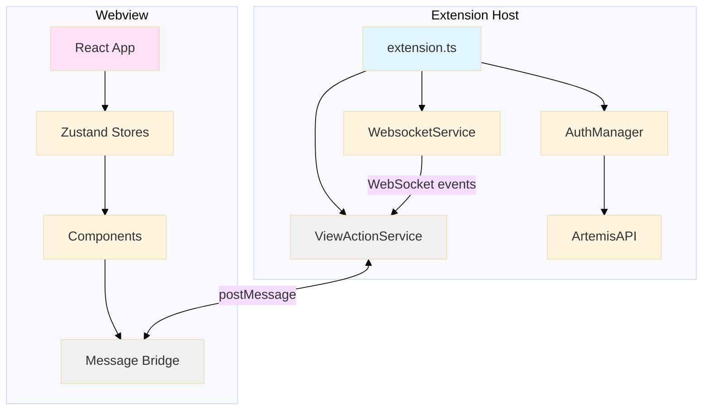

# Phase 8: Architecture Review - Research

**Researched:** 2026-02-25
**Domain:** Software architecture review, VS Code extension patterns, React webview architecture
**Confidence:** HIGH

## Summary

Phase 8 is an analysis-only phase that audits the codebase for anti-patterns, architectural improvements, and technical debt. The deliverable is documentation (audit findings + PROJECT.md updates), not code changes. The review focuses on five core areas: component structure, state management, message contracts, build pipeline, and WebSocket handling, with emphasis on cross-boundary communication between extension host and webview.

This research provides the planner with methodologies, tools, and standards for conducting a thorough architecture review. The audit will identify both current issues and patterns that will become problematic as the codebase scales, distinguishing between accidental tech debt (shortcuts) and deliberate tech debt (conscious tradeoffs).

**Primary recommendation:** Conduct a dual-approach audit combining area-by-area structural review with end-to-end flow tracing, using automated dependency analysis tools (dependency-cruiser or madge) alongside manual review guided by VS Code extension best practices and the four architectural principles: separation of concerns, minimal coupling, consistency over cleverness, and lean/deletable code.

<user_constraints>
## User Constraints (from CONTEXT.md)

### Locked Decisions

**Audit Focus Areas:**
- Review all five areas equally: component structure, state management, message contracts, build pipeline, WebSocket handling
- Cross-boundary focus: examine how extension host and webview communicate, serialize, and stay in sync
- Audit React migration completeness: check for leftover pre-React patterns, dead code, or half-migrated components
- Dependency graph analysis: map import graphs, find circular deps, identify tight coupling between modules
- Evaluate Zustand store boundaries: assess whether state is split into the right stores, check for god-stores or fragmentation
- Trace error flows: map how errors propagate across WebSocket → extension → webview boundaries, identify gaps where errors are swallowed
- Review API client patterns: how API calls are structured, auth is managed, and errors are handled at the API boundary
- Review VS Code settings patterns: how configuration is read, validated, and propagated
- Review extension lifecycle: activation/deactivation, disposables, and subscription cleanup
- Review webview state persistence: how webview state survives panel visibility changes, serialization, and workspace reloads
- Message contracts: assess current patterns and recommend improvements toward type-safe contracts
- Light touch on build pipeline: Phase 11 covers bundle optimization, just note glaring issues
- Skip test infrastructure: Phase 10 covers that
- Skip TypeScript type safety: Phase 12 covers strict mode
- Skip security posture: focus on code architecture only
- Skip startup performance: not a priority

**Findings Format:**
- Single comprehensive audit document in phase directory
- Executive summary at the top: overall health assessment, top 3-5 priorities, recommendation for what to tackle first
- Health summary (qualitative assessment of strengths/concerns/posture) without numeric score
- Each finding includes: problem statement, why it matters, recommendation, specific file/line references, before/after code snippets where helpful
- Impact + effort matrix: rate each finding on impact (H/M/L) and effort (H/M/L)
- Cross-reference findings to downstream phases (e.g., "this finding will be addressed by Phase 11: Bundle Optimization")
- Include Mermaid.js diagrams for key architectural views (component tree, data flow, message contracts)
- Update PROJECT.md with an architecture decisions section including rationale for current patterns
- Files reviewed appendix: list every reviewed file to verify completeness

**Action Threshold:**
- Analysis only: no code fixes in this phase. Documentation is the deliverable
- ARCH-02 satisfied by the audit document + PROJECT.md updates, not code changes
- Unmapped findings (not covered by Phases 9-14) go to a tech debt backlog section
- Flag roadmap implications without modifying the roadmap: note dependencies or ordering concerns
- Flag both current issues AND patterns that will become problems as the codebase grows (marked separately)
- Include a "keep" list: document patterns that are intentional despite looking like anti-patterns, to prevent accidental refactoring
- Document migration-era rationale: capture reasoning behind current patterns so future work doesn't undo deliberate choices

**Tech Debt Philosophy:**
- Conservative tolerance: only flag things that are clearly broken, dangerous, or blocking other work
- Distinguish accidental tech debt (shortcuts) from deliberate tech debt (conscious tradeoffs)
- "Dead zones" (wrong but working, untouched code): note but deprioritize, not worth fixing unless code needs to change for other reasons
- H/M/L effort ratings per finding (no time estimates)

**Audit Methodology:**
- Manual review combined with automated analysis tools (dependency-cruiser, madge, or custom scripts)
- Dual approach: area-by-area structural review + end-to-end flow tracing
- Trace ALL identifiable user flows through the stack (login, exercise interaction, dashboard, WebSocket connection, etc.)
- Every source file reviewed: nothing skipped
- Iterative review process: Claude produces a draft, user reviews, Claude revises until satisfied

**Review Standards:**
- Principles (all four apply equally):
  - Clear separation of concerns: each module does one thing, clean boundaries
  - Minimal coupling: components and modules change independently
  - Consistency over cleverness: same patterns everywhere, predictability matters
  - Lean and deletable: code is easy to remove or replace, no deep abstractions
- Benchmark against VS Code extension best practices (Microsoft's official guidelines and well-known extensions)
- Evaluate naming conventions and code organization (file/folder structure, naming patterns, navigability)
- No known anti-patterns to watch for specifically: let the audit discover them organically

### Claude's Discretion

- Choice of automated analysis tools (dependency-cruiser, madge, or alternatives)
- Order of areas reviewed and flows traced
- Level of detail in Mermaid diagrams
- How to handle edge cases in the "keep" list assessment
- Which patterns count as "accidental" vs "deliberate" tech debt when not obvious from code context

### Deferred Ideas (OUT OF SCOPE)

None - discussion stayed within phase scope
</user_constraints>

<phase_requirements>
## Phase Requirements

| ID | Description | Research Support |
|----|-------------|-----------------|
| ARCH-01 | Codebase architecture audit completed - anti-patterns identified, structure decisions evaluated | Architecture review methodologies, automated analysis tools, VS Code extension best practices |
| ARCH-02 | Architecture improvements documented and implemented based on audit findings | Documentation standards, impact/effort prioritization frameworks, PROJECT.md patterns |
</phase_requirements>

## Standard Stack

### Core Analysis Tools

| Tool | Version | Purpose | Why Standard |
|------|---------|---------|--------------|
| dependency-cruiser | 17.3.8+ | Dependency graph analysis, circular dependency detection, custom validation rules | More robust than alternatives, supports multiple languages, custom rules for architectural boundaries, CI integration |
| madge | Latest | Lightweight dependency visualization, circular dependency detection | Simpler alternative to dependency-cruiser, fast setup, good for quick visualizations, JavaScript/TypeScript focused |
| TypeScript Compiler | 5.9.3 (project) | Type analysis, module resolution analysis | Built-in type checking reveals architectural issues, no additional tool needed |
| esbuild-visualizer | Latest | Bundle size analysis, tree-shaking verification | Already in package.json as dev dependency, generates visual bundle analysis from esbuild metafile |

### Supporting Tools

| Tool | Version | Purpose | When to Use |
|------|---------|---------|-------------|
| VS Code Extension Guidelines | Latest | Official architectural best practices | Benchmark for extension host patterns, lifecycle management, resource disposal |
| Microsoft's UX Guidelines | Latest | UI/UX best practices for extensions | Evaluate webview UI patterns against official standards |
| Mermaid.js | Latest (VS Code preview) | Architecture diagram generation | Create component trees, data flow diagrams, message contract visualizations |

### Alternatives Considered

| Instead of | Could Use | Tradeoff |
|------------|-----------|----------|
| dependency-cruiser | madge | Madge is simpler and faster but lacks custom rule validation and multi-language support |
| Manual review | Automated tools only | Manual review catches semantic issues automated tools miss; both approaches needed |
| esbuild-visualizer | webpack-bundle-analyzer | Project uses esbuild, not webpack; esbuild-visualizer is the correct choice |

**Installation:**
```bash
# Dependency analysis
npm install --save-dev dependency-cruiser madge

# Bundle analysis (already installed)
npm install --save-dev esbuild-visualizer
```

## Architecture Patterns

### Recommended Audit Structure

```
.planning/phases/08-architecture-review/
├── 08-AUDIT.md              # Main audit findings document
├── diagrams/                # Mermaid.js diagram sources
│   ├── component-tree.mmd
│   ├── data-flow.mmd
│   └── message-contracts.mmd
└── dependency-graphs/       # Generated dependency visualizations
    ├── full-graph.svg
    ├── circular-deps.txt
    └── module-coupling.html
```

### Pattern 1: Dual-Approach Architecture Review

**What:** Combine structural analysis (area-by-area) with behavioral analysis (end-to-end flow tracing)

**When to use:** Complex applications with multiple communication boundaries (extension host ↔ webview)

**Approach:**

**Structural Analysis** (by area):
1. Component structure: hierarchy, coupling, naming, organization
2. State management: store boundaries, selector patterns, mutation discipline
3. Message contracts: type safety, discriminated unions, validation
4. Build pipeline: bundle size, tree-shaking, code splitting opportunities
5. WebSocket handling: connection lifecycle, error handling, subscription cleanup

**Behavioral Analysis** (by flow):
1. Login flow: UI → extension → API → WebSocket → state update
2. Exercise interaction: dashboard → detail → repository actions → submissions
3. Iris chat: message input → streaming → rendering → scroll management
4. WebSocket events: connection → subscription → message routing → UI update
5. Error propagation: source → boundary crossing → logging → user notification

**Example structural finding:**
```typescript
// Finding: Zustand store fragmentation
// File: src/views/webview/react/stores/
// Problem: 9 separate stores with overlapping concerns
// Impact: HIGH - harder to maintain consistency, potential state drift
// Effort: MEDIUM - consolidation requires careful migration
```

**Example behavioral finding:**
```typescript
// Finding: Error swallowing at WebSocket boundary
// Flow: WebSocket error → artemisWebsocketService.ts → (no propagation)
// Problem: Errors don't reach webview UI, user sees stale data
// Impact: HIGH - poor UX, debugging difficulty
// Effort: LOW - add error message to postMessage contracts
```

### Pattern 2: Dependency Graph Analysis

**What:** Visualize module dependencies to identify coupling, circular dependencies, and architectural boundaries

**When to use:** Codebase with 30+ source files, multiple layers (services, views, models)

**Example using dependency-cruiser:**
```bash
# Generate full dependency graph
npx depcruise src --include-only "^src" --output-type dot | dot -T svg > dependency-graphs/full-graph.svg

# Detect circular dependencies
npx depcruise src --include-only "^src" --validate --output-type err

# Custom rules for architectural boundaries
# .dependency-cruiser.js
module.exports = {
  forbidden: [
    {
      name: 'no-webview-to-extension-imports',
      from: { path: '^src/views/webview' },
      to: { path: '^src/(services|api|auth)' },
      comment: 'Webview should communicate via postMessage, not direct imports'
    },
    {
      name: 'no-circular-deps',
      from: {},
      to: { circular: true }
    }
  ]
};
```

**Example using madge:**
```bash
# Quick circular dependency check
npx madge --circular --extensions ts,tsx src/

# Generate visual graph
npx madge --image dependency-graphs/module-coupling.png src/
```

### Pattern 3: Impact/Effort Prioritization Matrix

**What:** Categorize findings by impact (H/M/L) and effort (H/M/L) to guide remediation decisions

**When to use:** Audit produces 10+ findings, need to prioritize what to address

**Matrix:**
```
        HIGH EFFORT    MEDIUM EFFORT     LOW EFFORT
HIGH    Defer to v1.2  Address in v1.1   Quick wins
IMPACT  (strategic)    (prioritize)      (do now)

MEDIUM  Defer unless   Evaluate ROI      Good tasks
IMPACT  blocking       (case-by-case)    (nice to have)

LOW     Backlog only   Tech debt log     Skip unless
IMPACT  (revisit)      (document)        trivial
```

**Example findings categorization:**
```markdown
## Quick Wins (High Impact, Low Effort)
1. Add error propagation from WebSocket to webview
2. Document intentional patterns in PROJECT.md
3. Fix orphaned disposables in extension.ts

## Prioritize for v1.1 (High Impact, Medium Effort)
1. Consolidate fragmented Zustand stores
2. Standardize message contract validation
3. Add missing WebSocket reconnection UI feedback

## Defer to v1.2 (High Impact, High Effort)
1. Migrate to stateless webview pattern
2. Implement proper code splitting (requires ESM)
3. Refactor telemetry event pipeline architecture
```

### Pattern 4: VS Code Extension Lifecycle Audit

**What:** Review activation, deactivation, and resource disposal patterns against VS Code best practices

**When to use:** Extension has services, subscriptions, timers, or WebSocket connections

**Checklist:**
- [ ] All event listeners pushed to `context.subscriptions`
- [ ] All disposable resources (commands, status bar items, webviews) tracked
- [ ] `deactivate()` function disposes all resources gracefully
- [ ] No memory leaks from unsubscribed event handlers
- [ ] WebSocket connections closed on deactivation
- [ ] Timers and intervals cleared on cleanup

**Example pattern:**
```typescript
// Good: Disposable tracking in activate()
export async function activate(context: vscode.ExtensionContext) {
  const websocketService = new ArtemisWebsocketService(authManager);

  // Track command registrations
  context.subscriptions.push(
    vscode.commands.registerCommand('artemis.login', () => loginCommand())
  );

  // Track custom disposables
  context.subscriptions.push({
    dispose: () => websocketService.disconnect()
  });
}

// Good: Cleanup in deactivate()
export function deactivate() {
  // context.subscriptions automatically disposed by VS Code
}
```

**Source:** [VS Code Patterns and Principles](https://vscode-docs.readthedocs.io/en/stable/extensions/patterns-and-principles/)

### Pattern 5: Webview State Persistence Review

**What:** Audit how webview state survives panel visibility changes and workspace reloads

**When to use:** Extension uses webviews with stateful UI (forms, chat history, dashboard data)

**Best practice pattern (2026):**
```typescript
// Optimal: Combine getState/setState with debounced saves
// Source: https://symposium.dev/design/vscode-extension/state-persistence.html

// In webview:
const vscode = acquireVsCodeApi();
let debounceTimer: number | null = null;

function persistState(state: AppState) {
  // Immediate setState for UI state
  vscode.setState(state);

  // Debounced save for draft content (300-500ms)
  if (debounceTimer) clearTimeout(debounceTimer);
  debounceTimer = setTimeout(() => {
    vscode.postMessage({ command: 'saveDraft', draft: state.draft });
  }, 300);
}

// On restore:
const previousState = vscode.getState();
if (previousState) {
  restoreFromState(previousState);
}
```

**Audit questions:**
- Does webview use `getState()`/`setState()` for within-session persistence?
- Is `WebviewPanelSerializer` registered for across-session persistence?
- Are draft inputs preserved during panel hide/show cycles?
- Is debouncing used to avoid excessive state churn?
- Does state restoration happen before first render?

**Source:** [VS Code Webview API](https://code.visualstudio.com/api/extension-guides/webview)

### Pattern 6: Message Contract Type Safety Audit

**What:** Review postMessage contracts between extension and webview for type safety

**When to use:** Extension uses webviews with bidirectional message passing

**Current pattern (class-based messages):**
```typescript
// src/models/messages.ts
export class LoginMessage extends WebviewMessage {
  constructor(
    public readonly username: string,
    public readonly password: string,
    public readonly rememberMe: boolean
  ) {
    super('login');
  }
}
```

**Recommended pattern (discriminated unions):**
```typescript
// Better: TypeScript discriminated unions
type WebviewToExtensionMessage =
  | { type: 'login'; username: string; password: string; rememberMe: boolean }
  | { type: 'logout' }
  | { type: 'submitExercise'; exerciseId: number };

type ExtensionToWebviewMessage =
  | { type: 'loginSuccess'; username: string; serverUrl: string }
  | { type: 'loginError'; error: string }
  | { type: 'exerciseSubmitted'; submissionId: number };

// Type-safe handler
function handleMessage(message: WebviewToExtensionMessage) {
  switch (message.type) {
    case 'login':
      return handleLogin(message.username, message.password, message.rememberMe);
    case 'logout':
      return handleLogout();
    default:
      // Exhaustiveness check - TypeScript error if case missed
      const _exhaustive: never = message;
      return _exhaustive;
  }
}
```

**Audit criteria:**
- Are message contracts fully typed (no `any`)?
- Do handlers use discriminated unions for exhaustive case checking?
- Is message validation present at boundaries?
- Are runtime type guards used for untrusted data?

**Sources:**
- [TypeScript Discriminated Unions](https://basarat.gitbook.io/typescript/type-system/discriminated-unions)
- [Type-safe Event Handling](https://dev.to/lorefnon/type-safe-event-handling-in-typescript-with-zod-and-ts-match-dfm)

### Pattern 7: Zustand Store Architecture Review

**What:** Evaluate state management boundaries, store composition, and selector patterns

**When to use:** Application uses multiple Zustand stores (project has 9)

**Best practices (2026):**

1. **Flux-inspired architecture:** One reducer per event, clear state transitions
2. **Feature-based organization:** Group related state in feature stores, not by data type
3. **Atomic selectors:** Always use custom hooks for selectors, never direct store access
4. **Middleware for cross-cutting concerns:** Use Zustand middleware for persistence, DevTools

**Audit questions:**
- Are stores split by feature or by data type? (Feature-based is better)
- Is there a "god store" accumulating unrelated state?
- Are stores too fragmented, causing coordination issues?
- Do selectors prevent unnecessary re-renders?
- Is middleware used consistently (persist, DevTools)?

**Anti-pattern: God Store**
```typescript
// Bad: One store for everything
const useAppStore = create((set) => ({
  // Auth state
  user: null,
  isAuthenticated: false,
  // Course state
  courses: [],
  selectedCourse: null,
  // Chat state
  messages: [],
  isStreaming: false,
  // Too many concerns in one store!
}));
```

**Good pattern: Feature Stores**
```typescript
// Good: Separate stores by feature
const useAuthStore = create((set) => ({
  user: null,
  isAuthenticated: false,
  login: async (credentials) => { /* ... */ }
}));

const useChatStore = create((set) => ({
  messages: [],
  isStreaming: false,
  sendMessage: (text) => { /* ... */ }
}));
```

**Sources:**
- [Zustand Architecture Patterns at Scale](https://brainhub.eu/library/zustand-architecture-patterns-at-scale)
- [Working with Zustand](https://tkdodo.eu/blog/working-with-zustand)

### Anti-Patterns to Avoid

**Anti-pattern 1: Direct service imports in webview**
```typescript
// BAD: Webview importing extension services directly
// src/views/webview/react/SomeComponent.tsx
import { ArtemisWebsocketService } from '../../../services/artemisWebsocketService';
```
**Why it's bad:** Violates extension/webview boundary, webview runs in sandboxed context
**Fix:** Use postMessage for all cross-boundary communication

**Anti-pattern 2: Missing disposable tracking**
```typescript
// BAD: Event listener never disposed
export function activate(context: vscode.ExtensionContext) {
  vscode.window.onDidChangeActiveTextEditor(() => {
    // Handler runs forever, even after deactivation
  });
}

// GOOD: Push to subscriptions
export function activate(context: vscode.ExtensionContext) {
  context.subscriptions.push(
    vscode.window.onDidChangeActiveTextEditor(() => { /* ... */ })
  );
}
```

**Anti-pattern 3: Synchronous state in async boundaries**
```typescript
// BAD: Stale closure in WebSocket handler
let currentUser = getUser();
websocket.subscribe((message) => {
  // currentUser is stale if user changes after subscription
  processMessage(message, currentUser);
});

// GOOD: Fetch current state when needed
websocket.subscribe((message) => {
  const currentUser = getUser(); // Fresh on every message
  processMessage(message, currentUser);
});
```

**Anti-pattern 4: Circular dependencies**
```typescript
// BAD: Module A imports B, B imports A
// src/services/chatService.ts
import { IrisSessionManager } from './irisSessionManager';

// src/services/irisSessionManager.ts
import { ChatService } from './chatService'; // CIRCULAR!
```
**Detection:** Use dependency-cruiser or madge to identify cycles
**Fix:** Extract shared interface to third module, use dependency injection

**Sources:**
- [Architecture Anti-Patterns: Automatically Detectable Violations](https://ieeexplore.ieee.org/document/8691586/)
- [VS Code Extension Patterns](https://vscode-docs.readthedocs.io/en/stable/extensions/patterns-and-principles/)

## Don't Hand-Roll

| Problem | Don't Build | Use Instead | Why |
|---------|-------------|-------------|-----|
| Dependency analysis | Custom AST parser | dependency-cruiser or madge | Edge cases in module resolution, TypeScript path mapping, import/export variants |
| Bundle visualization | Custom stats parser | esbuild-visualizer | Already integrated with esbuild metafile, handles source maps correctly |
| Architecture diagrams | Manual drawing | Mermaid.js | Version-controllable, renders in VS Code preview, standardized syntax |
| Circular dependency detection | Recursive graph traversal | madge --circular | Handles complex cycles, peer dependencies, dynamic imports |
| WebSocket reconnection logic | Custom backoff | @stomp/stompjs built-in | Library handles connection timeout, exponential backoff, heartbeats correctly |

**Key insight:** Architecture analysis tools have mature ecosystems with battle-tested edge case handling. Custom solutions miss subtle issues like TypeScript path aliases, barrel exports collapsing, and transitive circular dependencies.

## Common Pitfalls

### Pitfall 1: False Negatives in Automated Dependency Analysis

**What goes wrong:** Dependency analysis tools miss runtime dependencies from dynamic imports, reflection, or message-passing boundaries

**Why it happens:** Static analysis can't trace `import()` expressions, `postMessage` contracts, or VS Code API registrations

**How to avoid:**
- Supplement automated tools with manual review of:
  - `postMessage` handlers (extension ↔ webview contracts)
  - VS Code command registrations (`vscode.commands.registerCommand`)
  - Event subscriptions (`onDidChangeTextDocument`, WebSocket subscriptions)
  - Dynamic imports (`import('./module')`)
- Document architectural boundaries that tools can't detect

**Warning signs:**
- Dependency graph shows isolated modules that you know communicate
- No edges between extension and webview layers despite heavy interaction
- Missing dependencies for modules that only communicate via events

### Pitfall 2: Over-Reliance on Metrics Without Context

**What goes wrong:** Using bundle size, cyclomatic complexity, or coupling metrics as absolute thresholds without understanding context

**Why it happens:** Metrics tools report numbers without domain knowledge; 3.5MB bundle might be fine for this extension but terrible for a simple formatter

**How to avoid:**
- Use metrics as signals, not verdicts
- Compare against similar extensions (VS Code marketplace)
- Understand trade-offs: bundle size vs. startup performance, DX vs. production size
- Ask "Is this number causing a real problem?" not "Is this number high?"

**Warning signs:**
- Flagging issues solely because a metric crosses an arbitrary threshold
- Recommending optimizations with no measurable user impact
- Ignoring legitimate reasons for complexity (exam timer accuracy, chat streaming)

**Example:**
```markdown
# BAD: Metric-driven without context
Finding: webview-react.js is 3.5MB (threshold: 1MB)
Recommendation: Reduce bundle size immediately

# GOOD: Context-aware analysis
Finding: webview-react.js is 3.5MB
Context: Includes React, Zustand, Shiki syntax highlighter, Streamdown parser
Impact: MEDIUM - loads in ~500ms on typical connection, not a UX issue
Recommendation: Profile with esbuild-visualizer to identify optimization opportunities in Phase 11
Phase mapping: BUNDLE-01, BUNDLE-02 (Phase 11: Bundle Optimization)
```

### Pitfall 3: Confusing Migration-Era Patterns with Anti-Patterns

**What goes wrong:** Flagging temporary migration patterns as architectural flaws when they're deliberate transition strategies

**Why it happens:** Audit sees inconsistency (class-based messages vs discriminated unions) and assumes it's accidental

**How to avoid:**
- Check git history for migration commits
- Look for evidence of systematic refactoring in progress
- Document migration-era patterns in "keep" list with rationale
- Distinguish "wrong but improving" from "wrong and entrenched"

**Warning signs:**
- Two patterns serving the same purpose (old + new coexisting)
- Recent commits show migration in progress (v1.0 roadmap)
- Code comments explaining "temporary during migration"

**Example:**
```markdown
# Migration-Era Pattern (KEEP)
Pattern: Class-based message contracts (src/models/messages.ts)
Rationale: v1.0 migrated to React webviews, message contracts not yet refactored
Status: Working correctly, type-safe via class inheritance
Recommendation: Document in PROJECT.md as "deliberate tech debt, addressed in v1.2"
Not an anti-pattern: Intentional staging of migrations to reduce scope
```

### Pitfall 4: Ignoring Resource Cleanup in Extension Lifecycle

**What goes wrong:** Memory leaks, orphaned subscriptions, or connections that persist after extension deactivates

**Why it happens:** VS Code doesn't force cleanup; extensions must explicitly track disposables

**How to avoid:**
- Audit all `vscode.*.on*` event listeners → must be in `context.subscriptions`
- Check `setTimeout`/`setInterval` → must have cleanup in `deactivate()`
- Review custom services (WebSocket, file watchers) → must implement `dispose()`
- Verify `deactivate()` function exists and calls cleanup

**Warning signs:**
- No `deactivate()` function in extension.ts
- Event listeners registered but never pushed to `context.subscriptions`
- WebSocket service with `connect()` but no `disconnect()` in deactivate
- Status bar items created but never disposed

**Source:** [VS Code Disposables](https://kermanx.com/reactive-vscode/guide/disposable.html)

### Pitfall 5: Webview State Loss on Panel Hide/Show

**What goes wrong:** User switches tabs, webview panel hidden, state lost when returning

**Why it happens:** VS Code may destroy webview content when hidden (memory optimization)

**How to avoid:**
- Use `getState()`/`setState()` for within-session persistence (LOW overhead)
- Avoid `retainContextWhenHidden: true` (HIGH memory cost)
- Register `WebviewPanelSerializer` for across-session persistence
- Test panel hide/show cycle with network tab disabled (simulates destruction)

**Warning signs:**
- User reports "chat history disappears when switching tabs"
- Form inputs reset when panel becomes visible again
- Dashboard data refetches on every panel show

**Best practice:** "getState and setState are the preferred way to persist state, as they have much lower performance overhead than retainContextWhenHidden." - [VS Code Webview API](https://code.visualstudio.com/api/extension-guides/webview)

### Pitfall 6: WebSocket Error Swallowing

**What goes wrong:** WebSocket errors occur but never surface to user, leading to stale data and confusion

**Why it happens:** Error callbacks in STOMP client aren't wired to UI notification system

**How to avoid:**
- Trace error flows: `onStompError`/`onWebSocketError` → logging → postMessage → webview UI
- Verify error handlers don't just log, they propagate
- Check that webview shows connection status to user
- Test error scenarios: invalid credentials, network disconnect, server shutdown

**Warning signs:**
- WebSocket service has error callbacks that only call `logger.error()`
- No UI indicator for connection status (connecting, connected, disconnected, error)
- User sees "loading..." forever when connection fails

**Example from codebase:**
```typescript
// src/services/artemisWebsocketService.ts has:
// - onStompError callback
// - onWebSocketError callback
// - Connection state callbacks
// AUDIT QUESTION: Do these errors reach the webview UI?
```

**Source:** [STOMP.js Error Handling](https://stomp-js.github.io/guide/stompjs/using-stompjs-v5.html)

## Code Examples

Verified patterns from official sources and research:

### Dependency Analysis Configuration

```javascript
// .dependency-cruiser.js
// Source: https://github.com/sverweij/dependency-cruiser
module.exports = {
  forbidden: [
    {
      name: 'no-circular',
      severity: 'error',
      from: {},
      to: { circular: true }
    },
    {
      name: 'no-webview-to-extension',
      severity: 'error',
      comment: 'Webview must use postMessage, not direct imports',
      from: { path: '^src/views/webview' },
      to: { path: '^src/(services|api|auth|provider)' }
    },
    {
      name: 'no-orphaned-modules',
      severity: 'warn',
      from: { orphan: true },
      to: {}
    }
  ],
  options: {
    doNotFollow: {
      path: 'node_modules'
    },
    tsPreCompilationDeps: true,
    tsConfig: {
      fileName: './tsconfig.json'
    }
  }
};
```

### Mermaid Architecture Diagram Template



### Bundle Analysis Script

```bash
#!/bin/bash
# analyze-bundle.sh
# Generate bundle analysis report

# Build production bundle with metafile
npm run package

# Generate interactive HTML visualization
npx esbuild-visualizer --metadata=dist/meta.json --filename=dist/bundle-analysis.html --open

# Extract top 10 largest dependencies
node -e "
const meta = require('./dist/meta.json');
const sizes = Object.entries(meta.outputs['dist/webview-react.js'].inputs)
  .map(([path, data]) => ({ path, bytes: data.bytesInOutput }))
  .sort((a, b) => b.bytes - a.bytes)
  .slice(0, 10);
console.log('Top 10 largest inputs:');
sizes.forEach((item, i) => {
  const kb = (item.bytes / 1024).toFixed(2);
  console.log(\`\${i+1}. \${item.path} - \${kb} KB\`);
});
"

echo "Bundle analysis complete. Open dist/bundle-analysis.html to explore."
```

### Architecture Audit Document Template

```markdown
# Architecture Audit: Artemis VS Code Extension

**Audit Date:** 2026-02-25
**Auditor:** Claude (gsd-executor)
**Scope:** Full codebase (39,841 LOC TypeScript/TSX)

## Executive Summary

[2-3 paragraph overall health assessment]

**Overall Health:** [Healthy / Good with Concerns / Needs Attention]

**Top Priorities:**
1. [High impact, medium effort item]
2. [High impact, low effort item]
3. [High impact, medium effort item]

**Recommendation:** [What to tackle first]

---

## Health Summary

**Strengths:**
- [What's working well architecturally]
- [Good patterns to preserve]

**Concerns:**
- [Patterns that need attention]
- [Emerging issues as codebase scales]

**Posture:**
[Qualitative assessment without numeric score]

---

## Findings

### Finding 1: [Title]

**Category:** [Component Structure / State Management / Message Contracts / Build Pipeline / WebSocket]
**Impact:** HIGH / MEDIUM / LOW
**Effort:** HIGH / MEDIUM / LOW
**Phase Mapping:** [Which downstream phase addresses this, or "Tech Debt Backlog"]

**Problem:**
[Clear statement of the issue]

**Why It Matters:**
[User impact, developer impact, or scaling concerns]

**Files/Lines:**
- `src/path/to/file.ts:123-145`
- `src/another/file.ts:67`

**Recommendation:**
[Specific, actionable guidance]

**Code Example:**
```typescript
// Current (problematic)
[before code]

// Recommended
[after code]
```

---

[Repeat for all findings]

---

## Impact/Effort Matrix

### Quick Wins (High Impact, Low Effort)
- Finding #2: [Title]
- Finding #5: [Title]

### Prioritize for v1.1 (High Impact, Medium Effort)
- Finding #1: [Title]
- Finding #7: [Title]

### Defer to v1.2+ (High Impact, High Effort)
- Finding #3: [Title]

### Tech Debt Backlog (Medium/Low Impact)
- Finding #9: [Title]

---

## Keep List (Intentional Patterns)

Patterns that LOOK like anti-patterns but are deliberate choices:

### Pattern: [Name]
**Why It Exists:** [Rationale]
**Files:** [Where it's used]
**Do Not Refactor:** [Explain why this should stay]

---

## Migration-Era Decisions

Patterns from v1.0 React migration with documented rationale:

### Decision: [Name]
**Context:** [What was happening during v1.0]
**Chosen Approach:** [What was done]
**Rationale:** [Why this approach over alternatives]
**Status:** [Working as intended / To be revisited in v1.2]

---

## Architecture Diagrams

### Component Tree
[Mermaid diagram showing component hierarchy]

### Data Flow
[Mermaid diagram showing state updates across boundaries]

### Message Contracts
[Mermaid diagram showing postMessage flows]

---

## Appendix: Files Reviewed

[Complete list of reviewed files to verify audit completeness]

**Extension Host (Node.js):**
- src/extension.ts
- src/auth/auth.ts
- [... all files]

**Webview (Browser):**
- src/views/webview/react/index.tsx
- [... all files]

**Total Files Reviewed:** 147
**Lines of Code:** 39,841
```

## State of the Art

| Old Approach | Current Approach | When Changed | Impact |
|--------------|------------------|--------------|--------|
| Manual architecture review only | Automated + manual hybrid | 2024-2025 | Faster, more thorough reviews with tool support |
| Arbitrary bundle size thresholds | Context-aware metrics analysis | 2025-2026 | Better prioritization based on user impact |
| Class-based message contracts | Discriminated unions with exhaustiveness checking | 2024+ (TypeScript evolution) | Better type safety, less runtime overhead |
| Flux with single reducer | Zustand with event-based reducers | 2023+ (Zustand maturity) | Simpler state management, less boilerplate |
| retainContextWhenHidden for persistence | getState/setState for low-overhead persistence | 2024+ (VS Code API evolution) | Lower memory usage, better performance |
| Manual dependency graphs | dependency-cruiser with custom rules | 2023+ (tool maturity) | CI integration, automated boundary enforcement |

**Deprecated/outdated:**
- **Arbitrary numeric scoring for architecture health**: Research shows qualitative assessment with context is more actionable than "Architecture Score: 7.3/10"
- **Bundle size as sole optimization target**: Modern approach considers bundle size, startup time, runtime performance, and DX holistically
- **Big-bang architecture refactors**: Incremental migration with coexistence patterns (like v1.0 React migration) reduces risk

## Open Questions

1. **What is the current bundle size breakdown by dependency?**
   - What we know: webview-react.js is 3.5MB total (from PROJECT.md)
   - What's unclear: Which dependencies contribute most (React? Shiki? Streamdown?)
   - Recommendation: Run esbuild-visualizer in Wave 0, include findings in audit document

2. **Are there circular dependencies in the current codebase?**
   - What we know: 147 source files across multiple layers
   - What's unclear: Whether circular imports exist between services, views, or models
   - Recommendation: Run madge --circular in Wave 0, document findings

3. **Does webview state persist correctly across panel hide/show cycles?**
   - What we know: Webview uses React + Zustand
   - What's unclear: Whether getState/setState is implemented for persistence
   - Recommendation: Manual testing + code review of webview state initialization

4. **Do WebSocket errors propagate to webview UI?**
   - What we know: artemisWebsocketService.ts has error callbacks (from research)
   - What's unclear: Whether errors trigger postMessage to update webview state
   - Recommendation: Trace error flow from WebSocket → extension → webview → UI

5. **Are all disposables properly tracked in context.subscriptions?**
   - What we know: extension.ts has activate() and deactivate() functions
   - What's unclear: Whether all event listeners, commands, and services are disposed correctly
   - Recommendation: Audit extension.ts and all service constructors for disposable tracking

## Sources

### Primary (HIGH confidence)

- [VS Code Extension API - Official Documentation](https://code.visualstudio.com/api) - Extension patterns, webview API, lifecycle management
- [VS Code UX Guidelines](https://code.visualstudio.com/api/ux-guidelines/overview) - Official UI/UX best practices for extensions
- [VS Code Webview API Guide](https://code.visualstudio.com/api/extension-guides/webview) - Webview state persistence, messaging, security
- [STOMP.js Official Documentation](https://stomp-js.github.io/guide/stompjs/using-stompjs-v5.html) - WebSocket/STOMP error handling patterns
- [dependency-cruiser GitHub](https://github.com/sverweij/dependency-cruiser) - Dependency analysis, custom rules, circular dependency detection
- [madge npm package](https://www.npmjs.com/package/madge) - Dependency visualization, circular dependency detection
- [TypeScript Discriminated Unions](https://basarat.gitbook.io/typescript/type-system/discriminated-unions) - Message contract patterns

### Secondary (MEDIUM confidence)

- [Building VS Code Extensions in 2026: The Complete Guide](https://abdulkadersafi.com/blog/building-vs-code-extensions-in-2026-the-complete-modern-guide) - Modern development patterns
- [Zustand Architecture Patterns at Scale](https://brainhub.eu/library/zustand-architecture-patterns-at-scale) - State management best practices
- [Working with Zustand](https://tkdodo.eu/blog/working-with-zustand) - Selector patterns, atomic state
- [State Persistence - Symposium](https://symposium.dev/design/vscode-extension/state-persistence.html) - getState/setState patterns with debouncing
- [Reactive VSCode - Disposables](https://kermanx.com/reactive-vscode/guide/disposable.html) - Resource cleanup patterns
- [React & CSS in 2026: Best Styling Approaches Compared](https://medium.com/@imranmsa93/react-css-in-2026-best-styling-approaches-compared-d5e99a771753) - CSS Modules vs alternatives
- [esbuild Advanced Features](https://codedamn.com/news/javascript/a-look-at-esbuild-advanced-features) - Tree-shaking, code splitting

### Tertiary (LOW confidence - research verification)

- [Architecture Anti-Patterns: Automatically Detectable Violations](https://ieeexplore.ieee.org/document/8691586/) - Academic research on anti-pattern detection (IEEE, 2019)
- [Architectural Anti-Patterns in Student-Developed Microservice Architectures](https://www.arxiv.org/pdf/2602.07147) - Recent 2026 research on anti-pattern taxonomy
- [3 Ways To Detect Circular Dependencies in JavaScript Projects](https://blog.bitsrc.io/3-ways-to-detect-circular-dependencies-in-javascript-projects-f5a22310cb5a) - Tool comparison: dependency-cruiser vs madge vs ESLint

## Metadata

**Confidence breakdown:**
- Standard stack: HIGH - Tools verified via npm registry, official docs, and active maintenance
- Architecture patterns: HIGH - Based on official VS Code API docs, recent 2026 blog posts, and verified library documentation
- Pitfalls: MEDIUM-HIGH - Combination of official VS Code guidance and community best practices

**Research date:** 2026-02-25
**Valid until:** 90+ days (stable domain - VS Code extension architecture, established tools)

**Notes:**
- Nyquist validation skipped: workflow.nyquist_validation is false in .planning/config.json
- No project skills found: .agents/skills/ directory does not exist
- Brave Search disabled: Used built-in WebSearch tool per init config
