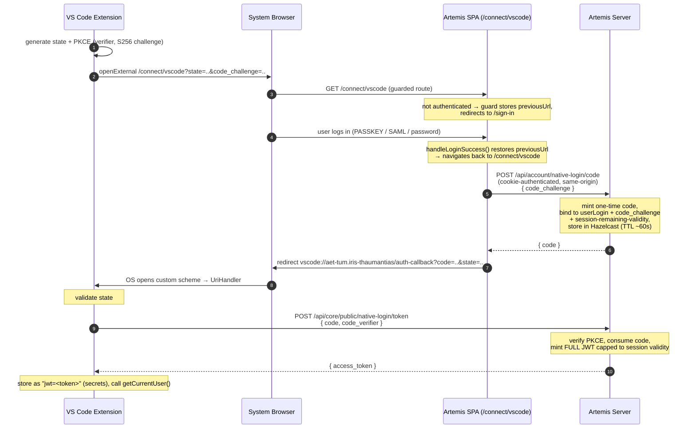

# Passkey (and SSO) Login for the Artemis VS Code Extension — Design

Status: investigation / design proposal
Branch: `investigate/passkey-auth`
Last updated: 2026-06-24

## TL;DR / Verdict

- **Passkeys are feasible, but not as a pure extension change.** A small, well-scoped Artemis addition is unavoidable.
- The Artemis server **already supports passkeys** fully (`webauthn4j-spring-security`, feature-flagged via `MODULE_FEATURE_PASSKEY`). The gap is purely the desktop client.
- **WebAuthn cannot run inside the extension** (webview origin/RP-ID mismatch; the webview CSP forbids frames anyway). Login must be **browser-delegated**: the user authenticates with their passkey in the system browser, then a token is handed back to the extension.
- The recommended mechanism is a **generic browser-to-native auth handoff using a one-time code + PKCE**. It is auth-method-agnostic and therefore covers **passkey, SAML SSO, and password** in a single flow.
- This **subsumes the dead SAML-only PR [ls1intum/Artemis#12534](https://github.com/ls1intum/Artemis/pull/12534)**, which should be mined for implementation patterns, not revived as a SAML-specific product.

## 1. Current state

### 1.1 Extension auth today (password-only)

- Desktop uses **Cookie auth**: the JWT is stored as the string `jwt=<token>` and sent as `Cookie: jwt=<token>`.
  See `extension/src/extension/services/auth/authManager.ts` (`storeArtemisCredentials`, `getAuthHeaders`).
- Login is a **pure password grant**: the webview collects username + password
  (`extension/src/webview/views/Login/LoginView.tsx`), the command handler
  (`extension/src/extension/controller/commands/authCommands.ts`) calls
  `artemisApi.authenticate()` which POSTs `{username, password, rememberMe}` to
  `/api/core/public/authenticate` and extracts the JWT from the `Set-Cookie` header
  (`extension/src/extension/api/artemisApi.ts`, `authenticate()`).
- Endpoint + cookie name constants: `extension/src/extension/utils/constants.ts`
  (`AUTH_COOKIE_NAME: 'jwt'`, `AUTHENTICATE: '/api/core/public/authenticate'`).

Consequence: the current flow structurally cannot carry a passkey (no password to send) and already excludes SAML-SSO-only users.

### 1.2 Artemis server (verified)

- Full passkey support: `webauthn4j-spring-security`; endpoints `/webauthn/register*` and `/login/webauthn`; admin passkey management; passkey autofill; documented in `SECURITY.md`. Feature-flagged (`MODULE_FEATURE_PASSKEY`, `@Conditional(PasskeyEnabled.class)`). Live on the TUM instance (30-day passkey tokens, rotating up to 180).
- On passkey login success, `ArtemisHttpMessageConverterAuthenticationSuccessHandler` sets the JWT via `Set-Cookie: jwt=...` (HttpOnly; `rememberMe=true`) and returns JSON `{redirectUrl, authenticated}` only. **The token is never in the body, only in the cookie.**
- WebAuthn origin enforcement is strict: `ArtemisPasskeyWebAuthnConfigurer` builds `allowedOrigins` from `server.url` (host + port) + Android APK key-hashes + optional extras; RP ID = server host. There is **no** `vscode-webview://` or loopback origin.
- `SecurityConfiguration.authenticationEntryPoint` is `HttpStatusEntryPoint(401)`: unauthenticated requests get **401, not a login-page redirect**. There is no server-side saved-request bounce.
- `TokenResource` (`POST /api/account/tool-token?tool=...`) converts a valid cookie into a **scoped** JWT (a `tools` claim). `ToolsInterceptor` rejects (403) any tool token on endpoints lacking `@AllowedTools`. So scoped tokens are unusable for the extension's broad API surface, and there is **no existing endpoint that returns a full (unscoped) JWT in the response body** to a cookie-authenticated caller.
- Precedent for "browser session -> JWT": `PublicUserJwtResource` `/api/core/public/authenticate` returns `{access_token}` in the body (but needs username + password), and `/api/core/public/saml2` converts a SAML-authenticated browser session into a JWT cookie.
- `JWTCookieService.buildLoginCookie(rememberMe, tool)` and `TokenProvider.createToken(..., tool)` mint the JWT; `tool = null` produces a full token.

### 1.3 Verified enabler: Artemis already returns to the attempted route after login

This removes the need for new login-return plumbing:

- `src/main/webapp/app/core/auth/user-route-access-service.ts`: when an unauthenticated user hits a guarded route (one declaring `authorities`), the guard stores `state.url` as `previousUrl` in session storage and redirects to `/sign-in`.
- `src/main/webapp/app/core/home/home.component.ts`: after login, `handleLoginSuccess()` retrieves `previousUrl` and calls `router.navigateByUrl(previousUrl)`.
- **All login paths funnel through `handleLoginSuccess()`** — password, the `authenticationSuccess` event, passkey autofill (conditional mediation), and the explicit `loginWithPasskey()`.

So a guarded SPA route (e.g. `/connect/vscode`) will be re-entered automatically after **any** login, including passkey.

## 2. Why browser-delegated is the only viable path

- **In-webview WebAuthn is not viable.** The webview origin is `vscode-webview://<guid>`, which is not a registrable suffix of the Artemis RP ID, so `navigator.credentials.get()` would refuse and the server would reject the origin. (Cross-origin iframe WebAuthn is theoretically allowed by spec, but the extension's webview CSP forbids frames — `extension/src/extension/services/ui/webviewHtml.ts` — and embedded auth is brittle. Not a real path.)
- **The token cannot be read from the browser** (HttpOnly cookie), and there is no full-token export endpoint. Therefore at least one new Artemis endpoint is mandatory.
- **Zero-Artemis-change is only possible for hardware security keys** via a native FIDO2 library that fabricates `clientDataJSON.origin = <artemis origin>`. This excludes platform passkeys (Touch ID / Windows Hello / phone), needs a per-platform native module, and is essentially origin-spoofing. Rejected.

## 3. Recommended design: generic browser-to-native handoff (one-time code + PKCE)

Auth-method-agnostic: works after any successful browser login (passkey, SAML, password).

### 3.1 Sequence

### 3.2 Components

**Extension (this repo):**
- New command "Sign in with browser".
- Declare `onUri` activation and register a `UriHandler` (`vscode.window.registerUriHandler`). The extension does not currently declare `onUri` in `extension/package.json`.
- Generate `state` (CSRF) + PKCE `code_verifier`/`code_challenge` (S256).
- Build the callback via `vscode.env.asExternalUri(...)` so it also works under VS Code Remote; for desktop this resolves to `vscode://aet-tum.iris-thaumantias/...`.
- On callback: validate `state`, exchange `code + code_verifier` for the JWT, store it as `jwt=<token>` via `authManager.storeArtemisCredentials(...)` (no change to the cookie architecture), then `getCurrentUser()`.
- Keep the password login as a fallback.

**Artemis server (new, small):**
- A short-lived one-time-code store (reuse the Hazelcast nonce-store pattern from PR #12534, generalized out of the SAML package).
- `POST /api/account/native-login/code` — authenticated (`@EnforceAtLeastStudent`), called same-origin from `/connect/vscode`. Accepts `code_challenge`. Mints a one-time code bound to the user, the challenge, and **the current session's remaining validity**. Returns `{ code }`.
- `POST /api/core/public/native-login/token` — public (the extension is not yet authenticated; PKCE protects it). Accepts `{ code, code_verifier }`, verifies PKCE, consumes the code once, mints a **full** JWT (`buildLoginCookie(..., tool=null)`) **capped to the originating session's remaining validity**, returns `{ access_token }`.

**Artemis webapp (new, small):**
- A guarded route/component `/connect/vscode` (declaring `authorities`) that, once authenticated, calls `native-login/code` and redirects the browser to the extension callback with `code` + `state`.

### 3.3 Security requirements (from codex review)

- **No raw token in a URL.** The one-time code + PKCE exchange keeps the long-lived (30–180 day) JWT out of browser history, OS protocol handling, and intermediary logs. This is the single most review-critical point.
- **No session-lifetime escalation.** The minted token must be capped to the remaining validity of the browser session that requested it (mirror `TokenResource`'s `Math.min(tokenRemainingTime, maxDuration)`), so a short password session cannot be upgraded to a 180-day token.
- **No open redirect.** Do not reflect an arbitrary `redirect_uri`. Pin the callback to the extension's scheme (`vscode://aet-tum.iris-thaumantias/*`) and/or the `asExternalUri`-produced URI; reject anything else.
- **Strict `state` matching** in the extension; with multiple VS Code windows the topmost handles the URI, so an unmatched `state` must be ignored gracefully.
- **Same-origin only.** The `native-login/code` call is made by the Artemis SPA to Artemis (cookie sent automatically). The extension never XHRs to a loopback; it only exchanges the code over HTTPS to Artemis. Avoids CORS and SameSite pitfalls.
- One-time code: single-use, short TTL (~60s), invalidated on first exchange.

## 4. Scope estimate (honest)

This is a small but real feature, not a 2-file change:

- **Artemis server:** code store + 2 endpoints (issue code, exchange code) ≈ 3 files (+ tests), reusing the nonce-store pattern from #12534.
- **Artemis webapp:** 1 route + 1 component (the `/connect/vscode` handoff page).
- **Extension:** UriHandler + `onUri` activation + "Sign in with browser" command + PKCE/state + code exchange + storage.

Still substantially smaller than the dead 14-file SAML-only PR, and it delivers SSO and passkey together. The login-return plumbing is free (Section 1.3).

## 5. Relationship to PR #12534

PR #12534 (`feature/general/saml2-sso-redirect-uri`, draft, auto-closed as stale) added a **SAML2-only** redirect-URI handoff that put the **raw JWT** in the callback URL via SAML RelayState + a SAML2-specific success handler. It does not touch the passkey flow.

Recommendation: do not revive it as-is. Build the generic handoff in Section 3 (PKCE, no raw token in URL, method-agnostic). Reuse its `SAML2RedirectUriValidator` and `HazelcastSaml2RedirectUriRepository` as the basis for the generalized validator/code store.

## 6. Open decisions

1. **Desktop-only vs Remote.** v1 can target desktop (`vscode://` callback). Remote/Codespaces via `asExternalUri` is a follow-up; the server callback allowlist must account for it.
2. **Fixed callback vs allowlisted set.** Pin to `vscode://aet-tum.iris-thaumantias/*` for the smallest, safest surface.
3. **Eventually migrate password login to this flow too?** Out of scope for v1, but it would let the extension drop in-app credential handling entirely.
4. **Upstream coordination.** This needs an Artemis PR; align the endpoint shape with the maintainers before implementing.

## 7. References

- VS Code URI handler & `asExternalUri`: https://code.visualstudio.com/api/references/vscode-api
- WebAuthn (secure context, iframe policy): https://developer.mozilla.org/en-US/docs/Web/API/Web_Authentication_API
- WebAuthn RP ID / effective domain: https://www.w3.org/TR/webauthn-3/
- RFC 8252 (OAuth for native apps, loopback redirects): https://datatracker.ietf.org/doc/html/rfc8252
- Dead SAML PR: https://github.com/ls1intum/Artemis/pull/12534
